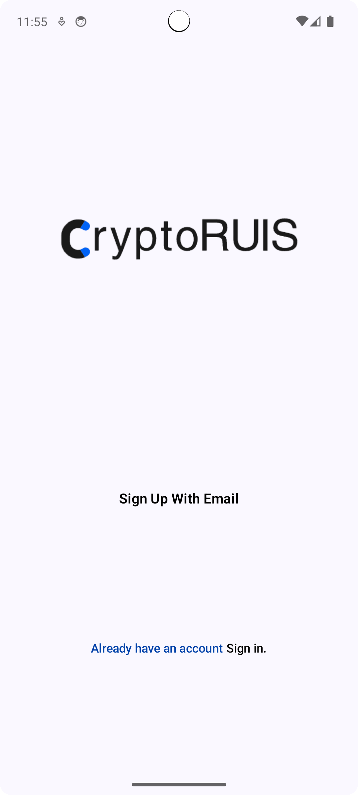
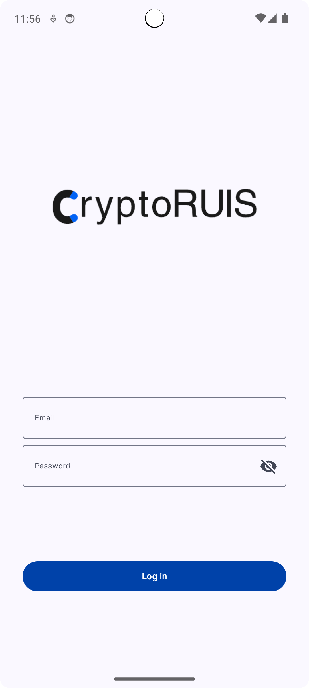
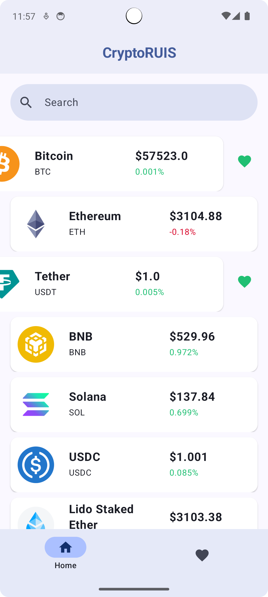
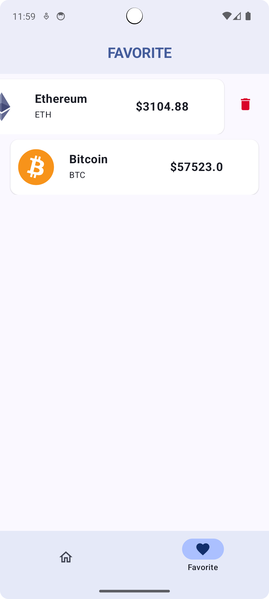
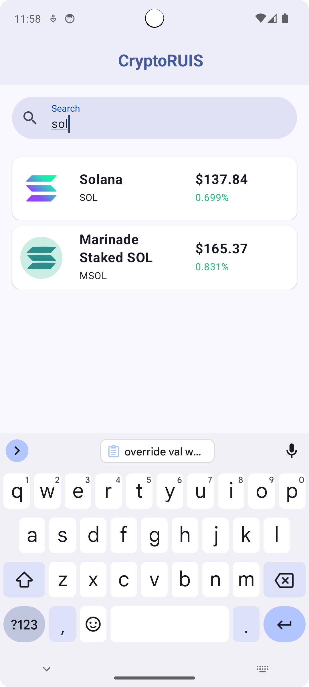
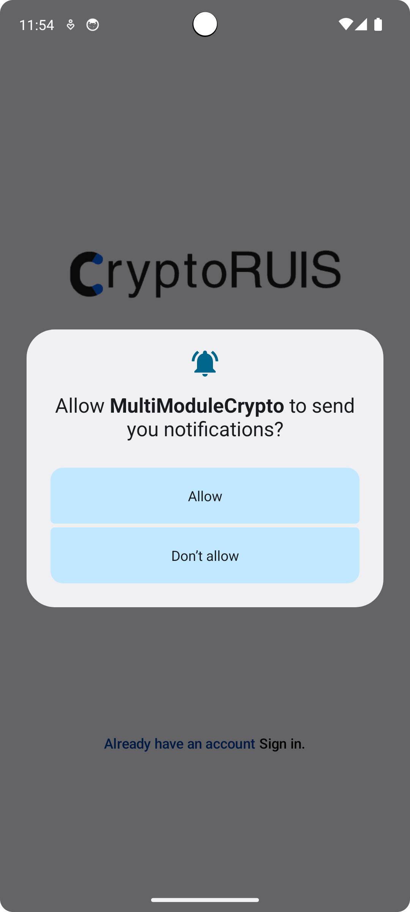
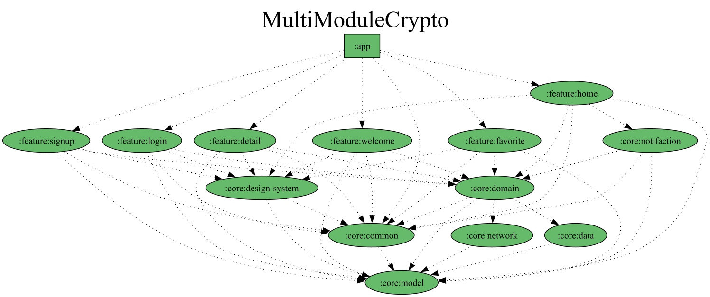

  

  
  
  

# Multi Module Cryptocurrency Price Tracker App
- Real-time Prices: Get up-to-date cryptocurrency prices.
- User Registration: Sign up effortlessly to unlock personalized features.
- User-friendly: Easy navigation and a clean interface.
- Customized: Add your favorite coins to your watchlist.
- Notifications: Receive alerts for price changes.

## Screenshoots
| Welcome | Sign Up | Login |
| ------ | ---- | ------ |
||||

 

| Home | favorite | detail |
| --- | ------- | ------- |
||||

 

| Search | notifaction |  
| ------ | ---------- |  
|||

## Multi Module Dependency Graph

  

## Tech stack & Open-source libraries

- Minimum SDK level 26
- <a href="https://kotlinlang.org/" target="_blank">Kotlin</a> based, Compose for UI Toolkit, <a href="https://github.com/Kotlin/kotlinx.coroutines" target="_blank">Coroutines</a> + <a href="https://kotlin.github.io/kotlinx.coroutines/kotlinx-coroutines-core/kotlinx.coroutines.flow/" target="_blank">Flow</a> for asynchronous jobs.
- Jetpack
    - <a href="https://developer.android.com/jetpack/compose" target="_blank">Compose</a>: Android’s recommended modern toolkit for building native UI.
    - <a href="https://developer.android.com/topic/libraries/architecture" target="_blank">Android Architecture Components</a>: Collection of libraries that help you design robust, testable, and maintainable apps.
        - <a href="https://developer.android.com/kotlin/coroutines" target="_blank">Coroutines</a>: Concurrency design pattern that you can use on Android to simplify code that executes asynchronously.
        - <a href="https://kotlinlang.org/docs/reference/coroutines/flow.html" target="_blank">Flow</a>: A flow is an asynchronous version of a Sequence, a type of collection whose values are lazily produced.
        - <a href="https://developer.android.com/jetpack/compose/navigation" target="_blank">Navigation with Compose</a>: Navigation component for Compose.
    - Firebase
        - <a href="https://firebase.google.com/products/firestore" target="_blank">Firestore</a>: for database.
        - <a href="https://firebase.google.com/products/auth" target="_blank">Authentication</a>: for user authentication.
    - Architecture
        - Multi-Module Architecture with lots of customized convention plugins (build_logic - app - core - feature)
        - MVVM Architecture (View - ViewModel - Model)
        - Clean Architecture approach (Data - Domain - Presentation(ui))

## API Reference 

The app uses the [CoinGecko](https://www.coingecko.com/en/api) 

(<a href="#readme-top">back to top</a>)

